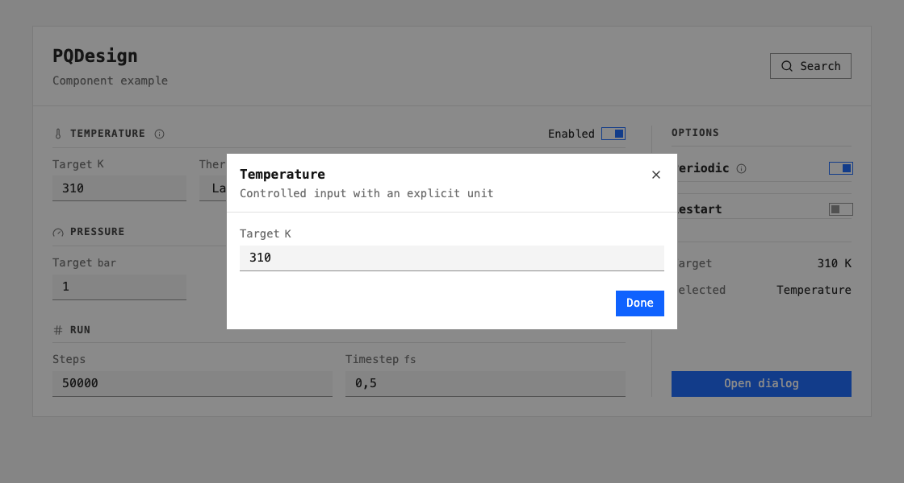
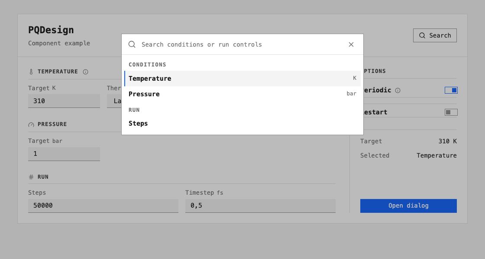

# Getting started



## Install

Use Node.js 20+ and a React project with CSS bundling:

```bash
npm install react@19 react-dom@19 lucide-react@0.468 \
  "https://github.com/MolarVerse/PQDesign/releases/download/v0.1.2/molarverse-pq-design-0.1.2.tgz"
```

Commit `package.json` and `package-lock.json`; reinstall with `npm ci`.

## Render a control

Put `<div id="root"></div>` in the HTML and this in the client entry point:

```tsx
import { useState } from "react";
import { createRoot } from "react-dom/client";
import { Field } from "@molarverse/pq-design";
import "@molarverse/pq-design/styles.css";

function TemperatureControl() {
  const [temperature, setTemperature] = useState("300");

  return (
    <Field label="Target" unit="K">
      <input type="number" min="0" value={temperature}
        onChange={(event) => setTemperature(event.target.value)} />
    </Field>
  );
}

createRoot(document.getElementById("root")!).render(<TemperatureControl />);
```

`Field` connects the label to its input. State and numeric validation stay
in the application. Import application CSS after `styles.css`.

## Dialog and search

The [component example](https://github.com/MolarVerse/PQDesign/blob/main/docs/examples/gallery.tsx)
uses the released controls:

| Action | Control | Behaviour |
| --- | --- | --- |
| Edit Target or Thermostat | `Field`, `Choice` | Change application state |
| Change Enabled, Periodic or Restart | `ConditionRow`, `Toggle` | Return a boolean through `onChange` |
| Hover or focus the information icon | `Info` | Show supplementary text |
| Open dialog | `Modal` | Edit Target; Done, Escape or Close ends the dialog |
| Search | `CommandPalette` | Filter commands; arrow keys select, Enter runs, Escape closes |



Dialogs and tooltips use the browser DOM. IBM Plex Mono is the preferred
font; supply its font files when that exact face is required.

## Existing controls and documentation

Import `tokens.css` for your own controls. It supplies variables without
global component selectors. For manuals, load that versioned token copy
before `docs/_static/pq-docs.css`. The shared adapter maps Furo variables on
`body` and retains Furo's dark palette. See [Reference](reference.md#documentation-styling)
for the mapping and [gallery reproduction](reference.md#reproduce-the-gallery).
