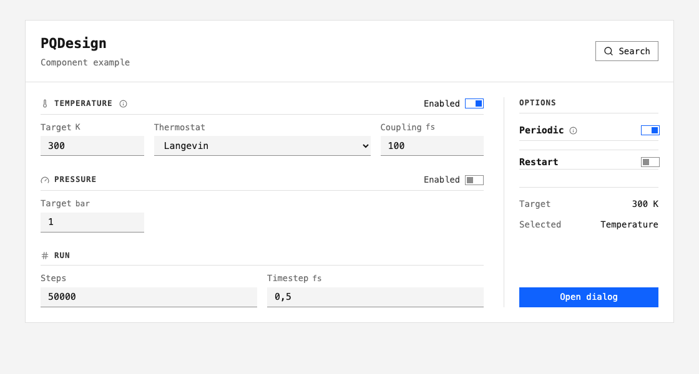

# PQDesign

Shared tokens, React controls and terminal presentation for scientific interfaces.



This is a [React component example](https://github.com/MolarVerse/PQDesign/blob/main/docs/examples/gallery.tsx)
using release 0.1.2. `Field` associates a label and unit with a control;
`ConditionRow` groups related inputs; `Toggle` changes a boolean value.
The application owns state, validation and page layout.

| Import from `@molarverse/pq-design` | Use |
| --- | --- |
| `styles.css` and React exports | Shared controls, typography and focus styles |
| `tokens.css` | Existing controls or documentation theme |
| `tokens.json` | Font, colour, shape and spacing values |
| `terminal.py` | Python wordmarks, help and event logs |

Start with the [visual guide](getting-started.md).
See [Reference](reference.md) for properties, tokens and release checks.

```{toctree}
:hidden:

getting-started
reference
terminal
```
