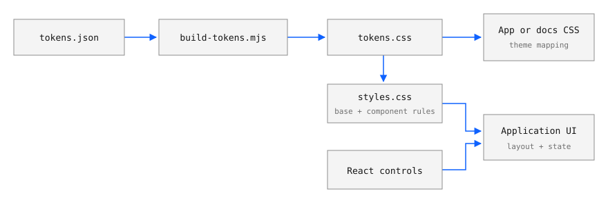

# Reference



## Package exports

| Import | Contents |
| --- | --- |
| `@molarverse/pq-design` | React controls, their exported types, `rankCommands` and `SearchableCommand` |
| `@molarverse/pq-design/styles.css` | Token stylesheet, base rules and component CSS |
| `@molarverse/pq-design/tokens.css` | Generated CSS custom properties |
| `@molarverse/pq-design/tokens.json` | Source design values |

## Controls

| Export | Required properties | Use |
| --- | --- | --- |
| `Field` | `label`, one control element as `children` | Labelled input; optional `unit`, `info`, `controlId`, `wide` |
| `Choice` | `label`, `value`, `options`, `onChange` | Select control; options contain `value` and `label`; optional `info`, `wide` |
| `Toggle` | `label`, `checked`, `onChange` | Boolean control; optional `detail`, `info`, `disabled`, `className` |
| `Group` | `title`, `children` | Section of related fields; optional `info` |
| `ConditionRow` | `icon`, `title` | Lucide icon and heading; optional fields, `hint`, `info`, `toggle`, `action`, `className` |
| `Modal` | `open`, `title`, `onClose`, `children` | Native dialog; optional `subtitle` and `size`: `md`, `lg`, `full`, `input` |
| `Info` | `text` | Supplementary text shown on hover, focus or click |
| `CommandPalette` | `open`, `commands`, `groupOrder`, `onClose` | Searchable dialog; optional `placeholder` |

Controlled values are returned through `onChange`. The consumer updates
state. Closing a dialog calls `onClose`; the consumer sets `open` to `false`.

Type exports are `FieldProps`, `ChoiceOption`, `ChoiceProps`, `ToggleProps`,
`GroupProps`, `ConditionRowProps`, `Command`, `CommandPaletteProps` and
`SearchableCommand`.

### Command search

Commands require `id`, `group`, `label` and a `run` callback. Optional
`detail`, `hint` and `keywords` provide searchable text. `featured` includes
a command in the empty-query list; `current` marks the active choice;
`disabledReason` prevents execution and supplies the displayed reason.

```ts
import { rankCommands, type SearchableCommand } from "@molarverse/pq-design";

const commands: SearchableCommand[] = [
  { id: "temperature", group: "Analysis", label: "Temperature", featured: true },
  { id: "energy", group: "Analysis", label: "Energy", keywords: ["potential"] },
];

const matches = rankCommands(commands, "potential", ["Analysis"]);
// matches[0].id === "energy"
```

Search normalizes case and accents, then matches words in labels and search
text. Every query word must match. `rankCommands` returns the original
objects ordered by score, group order and original position. The palette
displays those results in groups; groups absent from `groupOrder` come last.
Arrow keys move selection, Enter executes, and Escape closes the palette.

## Tokens

Edit `tokens.json`, then regenerate `src/styles/tokens.css`. JSON sections
map to CSS variables as follows:

| JSON section | CSS naming | Example |
| --- | --- | --- |
| `font` | `--mono` | Font stack |
| `color` | `--<name>`; `focus` becomes `--focus-color` | `--accent: #0f62fe` |
| `shape`, `space` | `--<name>` | `--radius: 0`, `--control: 32px` |
| `type` | `--type-<name>` | `--type-base-size: 14px` |
| `code` | `--code-<name>` | `--code-number: #6929c4` |

Use semantic roles such as `--ink`, `--muted`, `--surface`, `--border`,
`--accent`, `--focus-color`, `--success`, `--warning` and `--danger`. The token
stylesheet also sets `color-scheme: light`. The base stylesheet supplies a
two-pixel keyboard focus outline and default typography.

## Change and release

From the repository root:

```bash
npm ci
npm run tokens
npm test
npm run build
npm pack
node scripts/verify-package.mjs molarverse-pq-design-0.1.3.tgz
```

Commit regenerated CSS with token changes. When exports, token values or
public component classes change, update `package.json` and the lockfile
version. Use that version in the archive verification command.

The release workflow checks that a `v<version>` tag matches `package.json`
and points to a commit on `main`. It verifies the standalone archive, then
publishes the `.tgz` and `SHA256SUMS` to GitHub Releases. Consumers update
their archive URL and lockfile together. PQDesign versions are independent
of the Python application versions.

## Documentation styling

Copy the versioned `tokens.css`, shared `docs/_static/pq-docs.css`,
`pq-docs.js` and `pq-logo.png` into the manual's static assets;
record their source and checksum. Load tokens first. The script makes
unlinked figures open at full size; the logo also appears in narrow headers.
Furo supplies navigation and search. The adapter overrides variables on
`body`, where Furo defines them:

```css
body {
  --font-stack: var(--mono);
  --font-stack--monospace: var(--mono);
}

body[data-theme="light"] {
  --color-foreground-primary: var(--ink);
  --color-background-primary: var(--surface);
  --color-brand-primary: var(--accent);
}
```

```python
html_logo = "_static/pq-logo.png"
html_favicon = "_static/pq-logo.png"
html_css_files = ["pq-tokens.css", "pq-docs.css"]
html_js_files = ["pq-docs.js"]
```

The complete adapter also covers automatic light mode and retains Furo's
dark palette. Keep application layouts and font files with the consumer.
`styles.css` includes global selectors such as `body`, `.notice` and
`.command-palette`; `tokens.css` is the suitable input for an existing theme.

## Reproduce the gallery

Copy [the gallery files](https://github.com/MolarVerse/PQDesign/tree/main/docs/examples)
into an empty directory, then run:

```bash
npm install react@19 react-dom@19 lucide-react@0.468 \
  "https://github.com/MolarVerse/PQDesign/releases/download/v0.1.2/molarverse-pq-design-0.1.2.tgz"
npm install --save-dev esbuild@0.25.12
npx esbuild gallery.tsx --bundle --format=esm --jsx=automatic --outdir=dist
cp gallery.html dist/index.html
python3 -m http.server 9348 --bind 127.0.0.1 --directory dist
```

Open <http://127.0.0.1:9348>. The figures show these released controls at
1120 × 600: initial state; Target changed to 310 K with its dialog open;
and command search open. Capture details are in
[the image manifest](_static/components.source.json).
